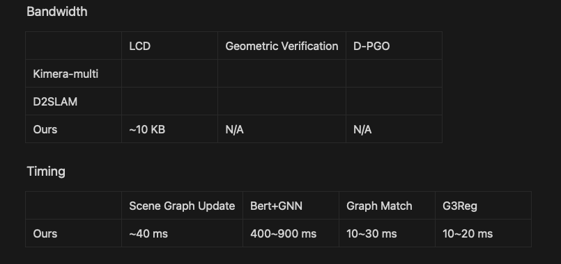

# SLAM tasks
We run three downstream tasks to demonstrate our scene graph registration method can be applied in SLAM tasks. The first and third tasks are parts of a SLAM system, while the second task is a post-processing module.

## 1. Mutli-agent relative localization (online)
### Comiple ROS
The SLAM tasks are implemented on the ROS platform. Our core module ```fmfusion``` is compiled as a shareable library. It can be called from a ROS node. 

Generate the ```lib_fmfusion``` as a shared library.
```
mkdir install
cd build
cmake -DINSTALL_FMFUSION=ON ..
make -j12 & make install
```
The library should be installed at ```install``` folder of the  current project.
Then, compile the ros nodes,
```bash
cd ../catkin_ws
source devel/setup.bash
catkin_make
```

### Run offline loop
Launch rviz for visualization,
```bash
roscore
roslaunch sgloop_ros visualize.launch
```

In another terminal, run the ```offline_loop``` node,
```bash
roslaunch sgloop_ros testloop.launch
```
It run two agent nodes that read two different reconstructed scene graphs. They broadcast and receive the transmitted scene graph. Then, they detect loop and estimate pose, similar to the executable program in ```TestLoop``` in C++.

Once the ```offline_loop``` is verified correct, run two-agent loop detection
```bash
roslaunch sgloop_ros online_loop.launch
```
It launch two agent nodes. Each agent incrementally reconstruct a semantic instance map. It broadcasts its active scene graph periodly. Meanwhile, it monitor the other agents topics and receive their scene graphs.

### Evaluation
We have record the loop results in each loop frame, including
- estimated pose
- matched instances
- timing and bandwidth
We store the results in ```DATAROOT/output/online_coarse```. And it has been updated to our [OneDrive Link](https://hkustconnect-my.sharepoint.com/:f:/g/personal/cliuci_connect_ust_hk/Encm_4ETKV9EiZ2PRlCLVdEBTCiuBYQ4yckF7SzFTDHg6g?e=oDsTHu). More instruction about the output data structure can be found in [DATA](DATA.md).

To run evaluation,
```python
python scripts/eval_loop.py
```
To save your time, the latest evaluation text is [here](eval/online_loop.txt).

Communication and Runtime



## 2. Merge submaps to construct a large-scale scene graph (post-processing)
This task is designed to merge mutliple sub-maps reconstructed in task1. The merged scene graph will be used as a reference map in the next task.

## 3. Relocalization in a large-scale scene graph