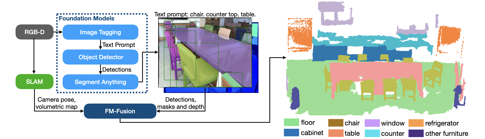

<div align="center">
    <h1>FM-Fusion: Instance-aware Semantic Mapping <br> Boosted by Vision-Language Foundation Models</h2>
    <strong>IEEE RA-L 2024</strong>
    <br>
        <a href="https://uav.hkust.edu.hk/current-members/" target="_blank">Chuhao Liu</a><sup>1</sup>,
        <a href="https://uav.hkust.edu.hk/group/alumni/" target="_blank">Ke Wang</a><sup>2,*</sup>,
        <a href="https://jayceeshi.github.io/" target="_blank">Jieqi Shi</a><sup>1</sup>,
        <a href="https://qiaozhijian.github.io/" target="_blank">Zhijian Qiao</a><sup>1</sup>, and
        <a href="https://uav.hkust.edu.hk/group/" target="_blank">Shaojie Shen</a><sup>1</sup>
    <p>
        <h45>
            <sup>1</sup>HKUST Aerial Robotics Group &nbsp;&nbsp;
            <sup>2</sup>Chang'an University, China &nbsp;&nbsp;
            <br>
        </h5>
        <sup>*</sup>Corresponding Author
    </p>
    <a href="https://ieeexplore.ieee.org/abstract/document/10403989">  </a>
    <a href='https://arxiv.org/abs/2402.04555'></a>
    <a href="https://www.youtube.com/watch?v=zrzcjj9-ydk&t=9s"></a>
</div>

<p align="center">
    
</p>

### News 
* [27th Nov 2024] Support semantic reconstruction using [SLABIM](https://github.com/HKUST-Aerial-Robotics/SLABIM) dataset.
* [25th Oct 2024] Publish code and RGB-D sequences from ScanNet and SgSlam. 
* [5th Jan 2024] Paper accepted by IEEE RA-L.

**FM-Fusion** utilizes [RAM](https://github.com/xinyu1205/recognize-anything), [GroundingDINO](https://github.com/IDEA-Research/GroundingDINO) and [SAM](https://github.com/facebookresearch/segment-anything) to reconstruct an instance-aware semantic map. Boosted by the vision foundational models, FM-Fusion can reconstruct semantic instances in real-world cluttered indoor environments. 
<p align="center">
    
</p>
<p align="center">
    
</p>

The following instruction explains how to run FM-Fusion on our RGB-D sequences or ScanNet sequences. If you find its useful, please cite our paper.

```latex
@article{
  title={{FM-Fusion}: Instance-aware Semantic Mapping Boosted by Vision-Language Foundation Models}, 
  author={Liu, Chuhao and Wang, Ke and Shi, Jieqi and Qiao, Zhijian and Shen, Shaojie},
  journal={IEEE Robotics and Automation Letters(RA-L)}, 
  year={2024}, 
  volume={9}, 
  number={3},
  pages={2232-2239}
}
```

## Tabel of Contents
1. Install
2. Download Data
3. Run Instance-aware Semantic Mapping
4. Use it in Your RGB-D Camera
5. Acknowledge
6. License

## 1. Install
Install dependency packages from Ubuntu Source
```
sudo apt-get install libboost-dev libomp-dev libeigen3-dev
```
Install Open3D from its source code.([Install Tutorial](https://www.open3d.org/docs/release/compilation.html#compilation))
```
git clone https://github.com/isl-org/Open3D
cd Open3D
mkdir build && cd build
cmake -DBUILD_SHARED_LIBS=ON ..
make -j12
sudo make install
```
Follow the official tutorials to install [OpenCV](https://docs.opencv.org/4.x/d7/d9f/tutorial_linux_install.html), [GLOG](https://github.com/google/glog), [jsoncpp](https://github.com/open-source-parsers/jsoncpp/blob/master/README.md).
To make it compatible with ROS, please install ```OpenCV 3.4.xx```.

Clone and compile FM-Fusion,
```
git clone git@github.com:HKUST-Aerial-Robotics/FM-Fusion.git
mkdir build && cd build
cmake .. -DINSTALL_FMFUSION=ON
make -j12
make install
```

Install the ROS node program, which renders the semantic instance map in Rviz. Install ROS platform following its [official guidance](http://wiki.ros.org/noetic/Installation/Ubuntu). Then, build the ros node we provide,
```
git submodule update --init --recursive
cd catkin_ws && catkin_make
source devel/setup.bash
```

## 2. Download Data
We provide two datasets to evaluate: SgSlam (captured using Intel [Realsense L-515](https://www.intelrealsense.com/lidar-camera-l515/)) and ScanNet. Their sequences can be downloaded:
* [SgSlam_OneDrive](https://hkustconnect-my.sharepoint.com/:f:/g/personal/cliuci_connect_ust_hk/EnIjnIl7a2NBtioZFfireM4B_PnZcIpwcB-P2-Fnh3FEPg?e=BKsgLQ) or [SgSlam_Nutstore(坚果云)](https://www.jianguoyun.com/p/DSM4iw0Q4cyEDRjUvekFIAA).
* [ScanNet_OneDrive](https://hkustconnect-my.sharepoint.com/:f:/g/personal/cliuci_connect_ust_hk/EhUu2zzwUGNKq8h2yUGHIawBpC8EI73YB_GTG9BUXXBoVA?e=o4TfsA) or [ScanNet_NutStore(坚果云)](https://www.jianguoyun.com/p/DVuHdogQ4cyEDRjQvekFIAA).

Please check [data format](doc/DATA.md) for the illustration about data in each sequence.
After download the ```scans``` folder in each dataset, go to [uncompress_data.py](scripts/uncompress_data.py) and set the data directories to your local directories. Then, un-compress the sequence data.
```
python scripts/uncompress_data.py
```

## 3. Run Instance-aware Semantic Mapping
#### a. Run with Rviz.

In ```launch/semantic_mapping.launch```, set the directories to your local dataset directories. Then, launch Rviz and the ROS node,
```
roslaunch sgloop_ros visualize.launch
roslaunch sgloop_ros semantic_mapping.launch
```
<p align="center">
    
</p>

It should incremental reconstruct the semantic map and render the results on Rviz. At the end of the sequence, the program save the output results, where the output format is illustrated in the [data format](doc/DATA.md). To visualize the results that are previously reconstructed, open ```launch/render_semantic_map.launch``` and set the ```result_folder``` directory accordingly. Then,
```
roslaunch sgloop_ros render_semantic_map.launch
```

***Tips***: If you are running the program on a remote server, you can utilize the [ROS across machine](http://wiki.ros.org/ROS/Tutorials/MultipleMachines) function. After set the ```rosmaster``` following the ROS tutorial, you can launch ```visualize.launch``` at your local machine and ```semantic_mapping.launch``` at the server. So, you can still visualize the result on your local machine.

#### b. Run without visualization.

If you do not need the ROS node to visualize, you can skip its install in the above instruction. Then, simply run the C++ executable program and the results will be saved at ```${SGSLAM_DATAROOT}/output```. The output directory can be set before run the program.
```
./build/src/IntegrateInstanceMap --config config/realsense.yaml --root ${SGSLAM_DATAROOT}/scans/ab0201_03a --output ${SGSLAM_DATAROOT}/output
```

## 4. Use it in Your RGB-D Camera
In ```SgSlam``` dataset, we use Intel Realsense-D515 camera and DJI A3 flight controller to collect data sequence Details of the hardware suite can be found in this [paper](https://arxiv.org/abs/2201.03312). You can also collect your own dataset using a similar hardware suite. 
#### a. Prepare RGB-D and Camera poses.
We use [VINS-Mono](https://github.com/HKUST-Aerial-Robotics/VINS-Mono) to compute visual-inertial odometry (VIO). We save the camera poses of its keyframes in a ```pose``` folder.

#### b. Run [RAM](https://github.com/xinyu1205/recognize-anything), [GroundingDINO](https://github.com/IDEA-Research/GroundingDINO) and [SAM](https://github.com/facebookresearch/segment-anything).

The three models are combined to run in [Grounded-SAM](https://github.com/IDEA-Research/Grounded-Segment-Anything). Please find our adopted Grounded-SAM [here](https://github.com/glennliu/Grounded-Segment-Anything). It should generate a ```prediction``` folder as explained in [data format](DATA.md). Then, you can run the semantic mapping on your dataset.

## 5. Acknowledge
The hardware used in SgSlam is supported by [Luqi Wang](https://lwangax.wordpress.com). The lidar-camera hardware used in [SLABIM](https://github.com/HKUST-Aerial-Robotics/SLABIM) is supported by [Skyland Innovation](https://www.skylandx.com).
In our program, we use and adopt [Open3D](https://www.open3d.org) to reconstruct instance sub-volume. The vision foundation models RAM, GroundingDINO, and SAM provide instance segmentation on images.

## 6. License
The source code is released under [GPLv3](https://www.gnu.org/licenses/) license.
For technical issues, please contact Chuhao LIU (cliuci@connect.ust.hk). 
